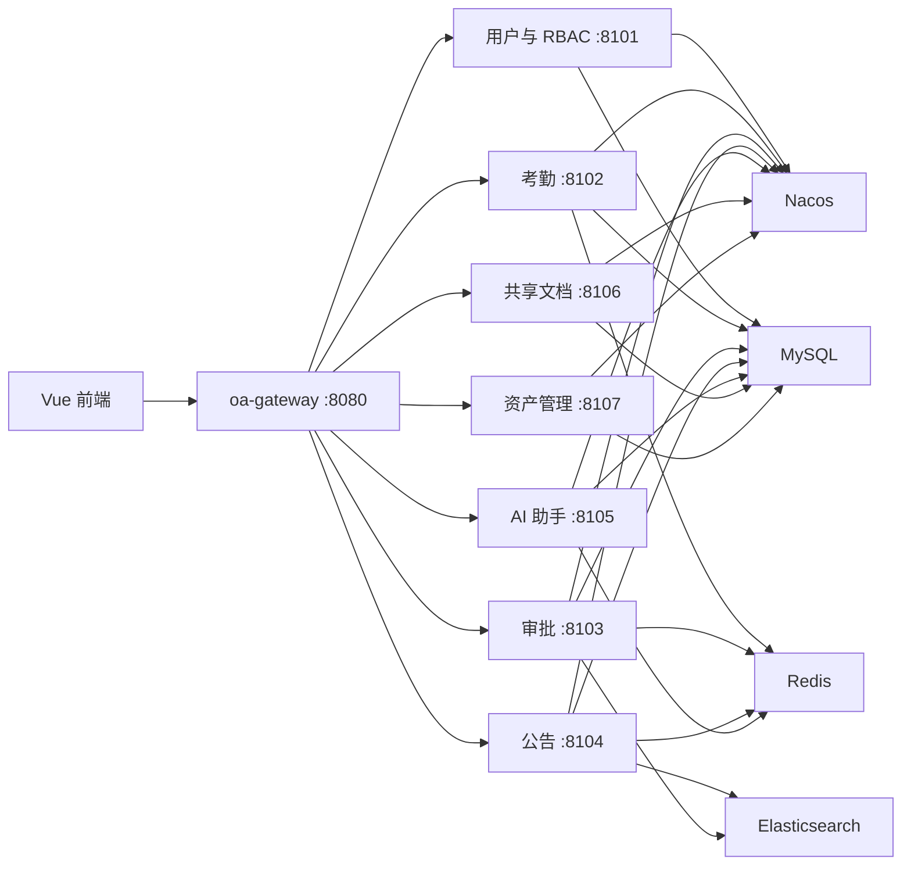

# OA 办公管理系统后端

基于 Spring Boot、Spring Cloud Alibaba 和 Spring AI 构建的企业 OA 微服务后端。项目通过统一网关提供认证鉴权、组织权限、考勤、审批、公告、AI 知识问答、共享文档和资产管理等能力。

前端仓库：[Personaowl/oa-system-frontend](https://github.com/Personaowl/oa-system-frontend)

## 技术栈

- JDK 21、Maven 3.9+
- Spring Boot 3.5.16
- Spring Cloud 2025.0.0
- Spring Cloud Alibaba 2025.0.0.0、Nacos 3.2.2
- Spring Security、JWT
- MyBatis-Plus 3.5.17、MySQL 8
- Redis 8.2.7
- Elasticsearch 8.18.1
- Spring AI 1.1.8、Redis Vector Store
- Apache POI（Excel 导出）

## 系统架构



## 服务模块

| 模块 | 默认端口 | 职责 |
| --- | ---: | --- |
| `oa-gateway` | 8080 | 服务路由、跨域、Trace ID、JWT 统一鉴权 |
| `oa-user-service` | 8101 | 登录注册、账户设置、部门、员工、薪资、动态 RBAC |
| `oa-attendance-service` | 8102 | 上下班打卡、工时、规则、班次、工作日历、补卡和统计 |
| `oa-flow-service` | 8103 | 请假/加班申请、审批任务、审批历史和流程检索 |
| `oa-notice-service` | 8104 | 公告生命周期、已读状态、全文检索 |
| `oa-ai-service` | 8105 | AI 会话、流式问答、RAG 知识库和问答日志 |
| `oa-document-service` | 8106 | 部门共享空间和富文本文档 |
| `oa-asset-service` | 8107 | 办公用品申领、固定资产及资产生命周期 |
| `oa-common` | — | 通用响应、异常处理、安全和 Redis 基础能力 |

## 已实现功能

- 登录、注册、JWT 签发及网关鉴权。
- 本地头像上传、密码修改和当前用户信息。
- 部门多负责人、员工档案及部门/员工 Excel 导出。
- 动态创建角色、分配权限，以及全部/本部门/仅本人数据范围。
- 独立薪资管理，支持 13A—20C 职级、绩效和扣除工资。
- 考勤打卡、迟到早退、缺卡、工时、班次、节假日工作日历、补卡和 Excel 导出。
- 请假与加班申请、待办/已办、审批意见、撤回及企业化审批约束。
- 公告发布、下线、置顶、已读统计和 Elasticsearch 高亮检索。
- AI 流式问答、知识文档导入、Redis 向量检索、会话与问答日志。
- 部门共享文档编辑、办公用品申领和固定资产管理。
- Redis 缓存及权限变更后的缓存失效处理。

## 环境要求

| 组件 | 推荐版本 | 默认地址 |
| --- | --- | --- |
| MySQL | 8.x | `127.0.0.1:3306` |
| Nacos | 3.2.2 | `127.0.0.1:8848` |
| Redis | 8.2.7 | `127.0.0.1:6379` |
| Elasticsearch | 8.18.1 | `127.0.0.1:9200` |

团队工作区的基础设施编排文件位于 `D:\oa-system\ops\compose.yaml`：

```powershell
docker compose -f "D:\oa-system\ops\compose.yaml" up -d
docker compose -f "D:\oa-system\ops\compose.yaml" ps
```

AI 服务使用兼容 OpenAI 协议的 SiliconFlow 接口。启动前请在 `oa-ai-service/src/main/resources/application.yml` 中配置有效的模型地址、模型名称和 API Key。

## 初始化数据库

1. 创建 `oa_system` 数据库。
2. 按文件名顺序执行 `sql/` 目录中的 SQL。
3. 演示环境建议完整执行至 `20-dynamic-rbac-data-scope.sql`。

本地默认数据库配置为：

```text
数据库：oa_system
用户名：root
密码：123456
```

可通过 `MYSQL_HOST`、`MYSQL_PORT`、`MYSQL_DATABASE`、`MYSQL_USERNAME` 和 `MYSQL_PASSWORD` 覆盖。默认值仅用于本地课程演示，不应直接用于生产环境。

### 演示账号

执行 `sql/08-demo-organization-data.sql` 后可使用以下账号，密码均为 `123456`：

| 账号 | 身份 |
| --- | --- |
| `mty-admin` | 超级管理员 |
| `mty-hr` | HR 人事 |
| `mty-manager` | 部门主管 |
| `mty-employee` | 普通员工 |

`sql/09-expanded-demo-data.sql` 会继续补充部门、员工及业务演示数据。

## 构建与测试

完整执行编译和单元测试：

```powershell
mvn -B -ntp clean verify
```

只验证指定服务及其依赖：

```powershell
mvn -pl oa-user-service -am test
mvn -pl oa-attendance-service -am test
```

## 本地启动

推荐在 IDEA 中依次启动以下入口类：

1. `UserServiceApplication`
2. `AttendanceServiceApplication`
3. `FlowServiceApplication`
4. `NoticeServiceApplication`
5. `AiServiceApplication`
6. `DocumentServiceApplication`
7. `AssetServiceApplication`
8. `OaGatewayApplication`

也可以在完成一次 Maven 安装后按模块启动：

```powershell
mvn -DskipTests install
mvn -pl oa-user-service spring-boot:run
```

所有前端请求统一访问网关：`http://localhost:8080/api/v1/...`。

## 配置说明

常用环境变量：

| 变量 | 默认值 | 用途 |
| --- | --- | --- |
| `NACOS_SERVER_ADDR` | `127.0.0.1:8848` | Nacos 地址 |
| `MYSQL_HOST` | `127.0.0.1` | MySQL 地址 |
| `MYSQL_PORT` | `3306` | MySQL 端口 |
| `MYSQL_DATABASE` | `oa_system` | 数据库名称 |
| `MYSQL_USERNAME` | `root` | 数据库用户名 |
| `MYSQL_PASSWORD` | `123456` | 数据库密码 |
| `REDIS_HOST` | `127.0.0.1` | Redis 地址 |
| `REDIS_PORT` | `6379` | Redis 端口 |
| `ELASTICSEARCH_URIS` | `http://127.0.0.1:9200` | Elasticsearch 地址 |

## 项目目录

```text
oa-common/              通用基础模块
oa-gateway/             API 网关
oa-*-service/           各业务微服务
sql/                    建库、迁移及演示数据脚本
docs/                   架构与接口文档
.github/workflows/      GitHub Actions 后端验证
```

更多资料：

- [系统架构](docs/architecture.md)
- [认证接口](docs/auth-api.md)
- [动态 RBAC](docs/rbac-api.md)
- [审批接口](docs/flow-api.md)
- [AI 问答模块](docs/ai-qa-module.md)
- [协作规范](docs/contributing.md)

## 安全说明

仓库中的默认密码和本地配置仅用于课程开发与演示。部署到共享或生产环境前，请更换数据库密码、JWT 密钥、Nacos 配置及模型 API Key，并启用 HTTPS 和服务端访问控制。
